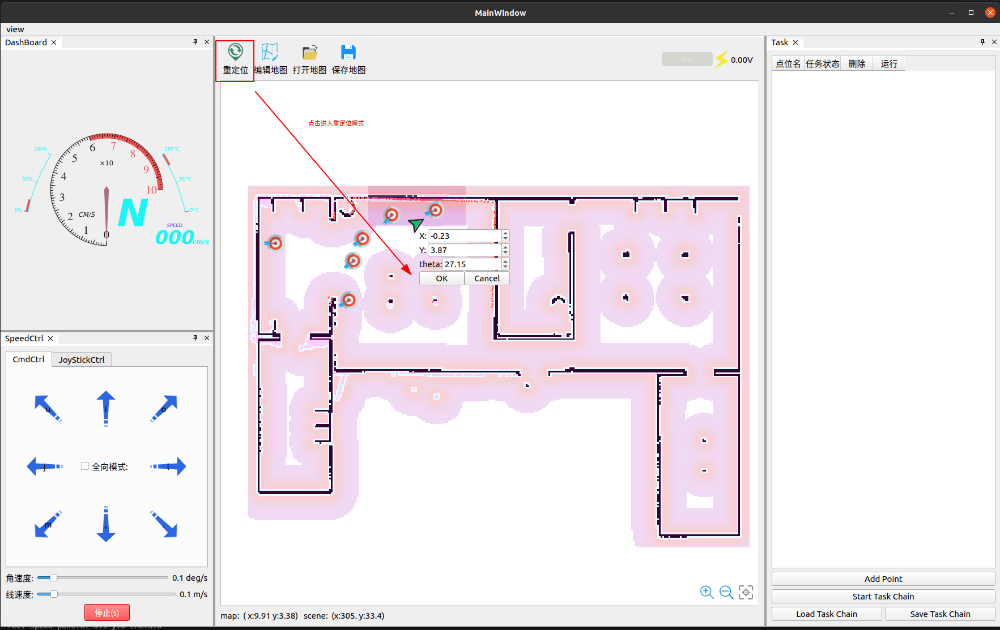
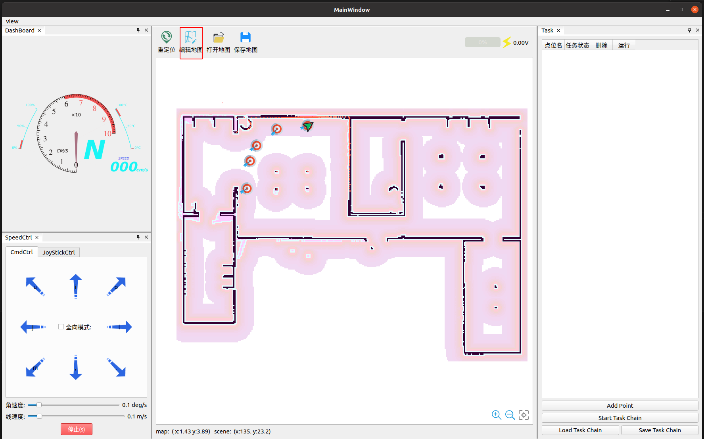
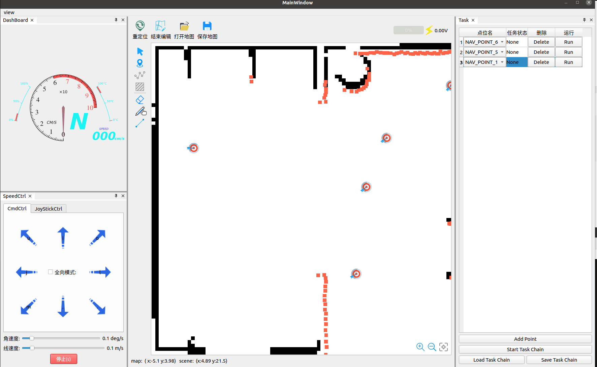
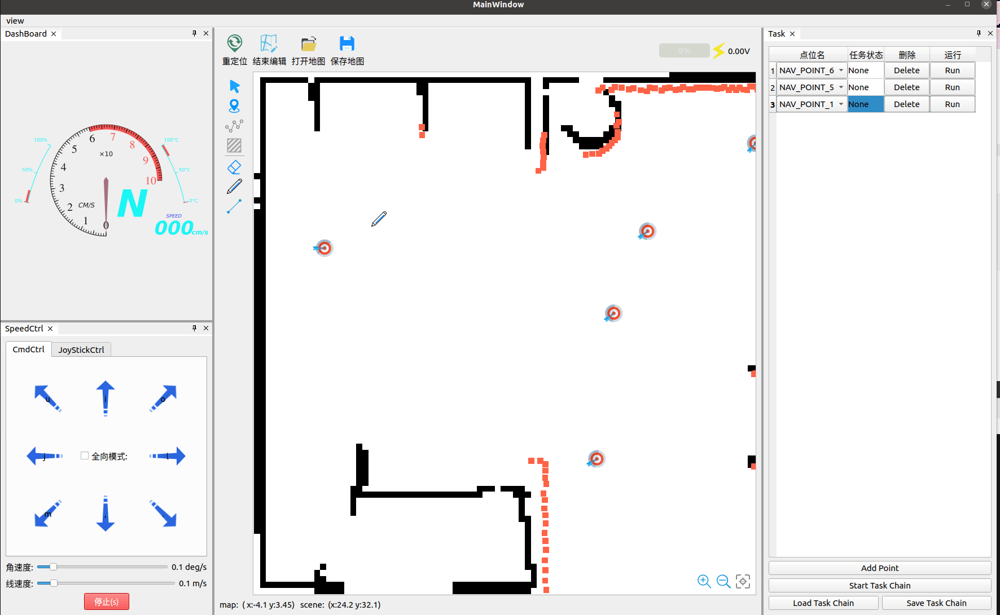

<!--
 * @Author: chengyangkj chengyangkj@qq.com
 * @Date: 2023-09-02 07:23:43
 * @LastEditors: chengyangkj chengyangkj@qq.com
 * @LastEditTime: 2023-10-06 14:03:03
 * @FilePath: /ROS2_Qt5_Gui_App/README.md
-->
Simplified Chinese | [English](./README_en.md)
## Lightweight ROS1/ROS2 Mobile Robot Human-Machine Interaction Software


<a href="http://qm.qq.com/cgi-bin/qm/qr?_wv=1027&k=mvzoO6tJQtu0ZQYa_itHW7JrT0i4OCdK&authKey=exOT53pUpRG85mwuSMstWKbLlnrme%2FEuJE0Rt%2Fw6ONNvfHqftoWMay03mk1Qi7yv&noverify=0&group_code=797497206">

</a>


<!-- 
<a href="https://www.bilibili.com/video/BV14h4y1w7TC">

</a>
<a href="https://www.bilibili.com/video/BV11h4y1y74H">

</a>
-->

This project is developed based on Qt5 and built with CMake, and it can be used in both ROS1 and ROS2 systems with the same codebase. The project has integrated continuous integration (CI) to ensure usability across multiple ROS versions and system versions.

During compilation, the software will automatically detect the ROS1/ROS2 environment variables and build accordingly, achieving ROS communication and UI isolation.

All the features of the software are self-drawn, making it easy to run on edge devices with lower performance.

Features/TODO:

| Feature                                 | Status | Remarks |
| --------------------------------------- | ------ | ------- |
| ROS1/ROS2 communication                 | ✅      |         |
| Global/local map display                | ✅      |         |
| Real-time robot position display        | ✅      |         |
| Robot speed dashboard                   | ✅      |         |
| Manual robot control                    | ✅      |         |
| Robot relocation                        | ✅      |         |
| Single/multi-point robot navigation     | ✅      |         |
| Global/local planned trajectory display | ✅      |         |
| Robot topological map function          | ✅      |         |
| Battery level display                   | ✅      |         |
| Map editing function                    | ✅      |         |
| Robot navigation task chain             | ✅      |         |
| Communication based on protobuf         | 🏷️      |         |
| Eagle-eye view                          | 🏷️      |         |
| 3D layer display                        | 🏷️      |         |
| Camera image display                    | 🏷️      |         |

If anyone has interesting interface/functional requirements, they can submit them [here](https://github.com/chengyangkj/Ros_Qt5_Gui_App/issues/29). If there are any bugs, please submit them to [issues](https://github.com/chengyangkj/Ros_Qt5_Gui_App/issues), and they will be fixed as soon as possible. Pull requests for project development are also welcome.

This repository's domestic accelerated mirror link: [gitee](https://gitee.com/chengyangkj/Ros_Qt5_Gui_App)

  <picture>
    <source media="(prefers-color-scheme: dark)" srcset="https://api.star-history.com/svg?repos=chengyangkj/Ros_Qt5_Gui_App&type=Timeline&theme=dark" />
    <source media="(prefers-color-scheme: light)" srcset="https://api.star-history.com/svg?repos=chengyangkj/Ros_Qt5_Gui_App&type=Timeline" />
    
  </picture>

## Project Screenshots


<!-- TOC -->
## Table of Contents

- [1. Release Version Download and Use](#1-release-version-download-and-use)
- [2. Compilation](#2-compilation)
  - [1. Environment Installation](#1-environment-installation)
  - [2. Cloning/Downloading the Project:](#2-cloningdownloading-the-project)
  - [3. Building the Project](#3-building-the-project)
  - [4. Running the Project](#4-running-the-project)
- [3. Usage Instructions](#3-usage-instructions)
    - [3.1. Multi-Machine Communication Configuration](#31-multi-machine-communication-configuration)
    - [3.2. Configuration File](#32-configuration-file)
    - [3.3. Relocation Pose Publishing](#33-relocation-pose-publishing)
    - [3.4. Map Editing](#34-map-editing)
      - [3.4.1 Topological Map (Robot Navigation Point Setting)](#341-topological-map-robot-navigation-point-setting)
      - [3.4.2 Eraser](#342-eraser)
      - [3.4.3 Pen](#343-pen)
      - [3.4.4 Line Drawing](#344-line-drawing)
      - [3.4.5 Map Saving](#345-map-saving)
      - [3.4.6 Map Loading](#346-map-loading)
    - [3.5. Manual Robot Control](#35-manual-robot-control)
    - [3.6. Speed Dashboard](#36-speed-dashboard)
    - [3.7. Battery Level Display](#37-battery-level-display)
    - [3.8 Multi-Point Continuous Navigation](#38-multi-point-continuous-navigation)
- [4. Related Links](#4-related-links)

<!-- /TOC -->

# 1. Release Version Download and Use

Users can choose to download the pre-compiled Release version, eliminating the need for manual compilation. Before using the Release version, the system's ROS environment must be installed and sourced into the environment variables.

This repository uses CI to automatically generate Release versions for various platforms (currently only X86_64 versions; Arm environments need to be compiled independently). Download the latest Release version corresponding to the ROS version from the [Release page](https://github.com/chengyangkj/Ros_Qt5_Gui_App/releases) of the project. In theory, you can use it after extracting the files.
Usage:
Navigate to the extracted folder path in the terminal and execute the following command:

```
sudo chmod a+x ./ros_qt5_gui_app
./ros_qt5_gui_app
```

If the Release version cannot be used after downloading, you can refer to [2. Compilation](#2-compilation) for manual compilation and usage.

# 2. Compilation

Note that in order to ensure that this project is compatible with both ROS1 and ROS2, it does not use the native catkin_make/colcon build system of ROS1/ROS2 for construction. Instead, it uses standard CMake for building, which also means that this project will not be automatically recognized by ROS as a package.

You can follow the tutorial below to build and run this project from scratch:

## 1. Environment Installation 

Theoretically, only the following basic packages need to be installed to compile this project:

```
sudo apt-get update
sudo apt-get install qtbase5-private-dev libqt5svg5-dev -y
```

If the above installation does not work, you can install all dependencies with the following command:

```
sudo apt-get install qtbase5-dev qt5-qmake qtbase5-dev-tools libqt5svg5-dev qtbase5-private-dev libeigen3-dev libgtest-dev -y
```

## 2. Cloning/Downloading the Project:

```
mkdir -p ~/qt_ws
cd ~/qt_ws
git clone https://github.com/chengyangkj/Ros_Qt5_Gui_App
```

Note: If the GitHub download speed is slow, you can use the following command to pull from Gitee:

```
git clone https://gitee.com/chengyangkj/Ros_Qt5_Gui_App
```

## 3. Building the Project

You can manually execute the following commands to build the project (it will automatically identify whether it is an ROS1 or ROS2 environment based on the environment variables):

```
cd ~/qt_ws/ROS2_Qt5_Gui_App
mkdir -p build
cd build
cmake ..
make
```

Or you can execute the following script to specify the ROS version and perform one-click compilation:

```
cd ~/qt_ws/ROS2_Qt5_Gui_App
```
For ROS1:

```
sh ./build_ros1.sh
```

For ROS2:

```
sh ./build_ros2.sh
```

## 4. Running the Project

```
cd ~/qt_ws/ROS2_Qt5_Gui_App/build
./ros_qt5_gui_app
```

The software configuration file path (generated after running the software once) is:

```
~/qt_ws/ROS2_Qt5_Gui_App/build/config.json
```

# 3. Usage Instructions

### 3.1. Multi-Machine Communication Configuration

For ROS beginners, if the software is running on a single machine without the need for cross-machine communication, this configuration is not necessary. It is only required when running the software on your own laptop to connect to a remote robot.

ROS1/ROS2's multi-machine communication relies entirely on ROS's native (environment variable) configuration (ROS_MASTER_URI and ROS_IP/ROS_DOMAINID), and no longer needs to be manually specified by the user, reducing the burden on new users.

ROS1:

Configuration reference: Multi-Machine Communication Tutorial [CSDN Blog](https://blog.csdn.net/qq_38441692/article/details/98205852)

ROS2:

The environment variable multi-machine configuration is the same with ROS_DOMAINID.

### 3.2. Configuration File

After the first run, the config.json file will be generated in the same directory as the executable program. Modify this configuration file (note the JSON format) to take effect after modification. For specific configuration instructions, see [Configuration File Description](./doc/config.md).

### 3.3. Relocation Pose Publishing

The program allows dragging to set the initial position of the robot (relocation). Compared to Rviz, dragging allows real-time viewing of laser matching, resulting in more accurate relocation (left-click and drag, right-click to rotate direction).




Note: If the setting is invalid, check the following settings in the config.json file:

```
{
      "display_name": "Reloc",
      "topic": "/initialpose",
      "enable": true
}
```
Replace "/initialpose" with the relocation topic name listened to by your robot.

### 3.4. Map Editing

The program supports map editing functionality:




#### 3.4.1 Topological Map (Robot Navigation Point Setting)

The program also supports topological map functionality, allowing drag-and-drop setting of robot navigation target points (navigation). See the gif for a demonstration:


Note: If the navigation point publishing has no response and the setting is invalid, check the following settings in the config.json file:

```
{
      "display_name": "NavGoal",
      "topic": "/move_base_simple/goal",
      "enable": true
}
```
Replace "/move_base_simple/goal" with the navigation goal topic name listened to by your robot.

#### 3.4.2 Eraser

After clicking the eraser, you can erase obstacles in the map. See the gif for a demonstration:


#### 3.4.3 Pen

Pen functionality



#### 3.4.4 Line Drawing

Line drawing



#### 3.4.5 Map Saving

After editing the map, it is not automatically saved. You need to click the save button to save the map to the specified folder. If you intend to use it in ROS, you need to replace the map in your corresponding navigation package's map folder.

Currently, the saved map includes:

- *.pgm image data
- *.yaml map description file
- *.topology the custom topological map of the program, saving point information, etc.


#### 3.4.6 Map Loading

Similarly, you can load a map by selecting the corresponding PGM map file and begin editing.

### 3.5. Manual Robot Control

The software supports publishing real-time speeds to the robot base:


The text on the corresponding buttons can be invoked synchronously by keyboard buttons.

Note: If the setting is invalid, check the following settings in the config.json file:

```
{
      "display_name": "Speed",
      "topic": "/cmd_vel",
      "enable": true
}
```
Replace "/cmd_vel" with the actual topic listened to by your robot for speed control.

### 3.6. Speed Dashboard

The software supports real-time display of robot speed:


Note: If the setting is invalid, check the following settings in the config.json file:

```
{
      "display_name": "Odometry",
      "topic": "/odom",
      "enable": true
}
```

Replace "/odom" with the topic of odom published by the robot.

### 3.7. Battery Level Display

The software supports real-time display of robot battery level. In the configuration, provide the topic name for the battery level, with the topic type being sensor_msgs::BatteryState.

```
{
      "display_name": "Battery",
      "topic": "/battery",
      "enable": true
}
```


### 3.8 Multi-Point Continuous Navigation

The software supports multi-point continuous navigation. To use this feature, refer to the gif for usage:


Click "Start Task Chain" to start the task:


# 4. Related Links


| Friendly Name                                                                      | Supported Platforms                           | Function                                                                                                                                           |
| ---------------------------------------------------------------------------------- | --------------------------------------------- | -------------------------------------------------------------------------------------------------------------------------------------------------- |
| [master](https://github.com/chengyangkj/Ros_Qt5_Gui_App/tree/master)               | Win10 Ubuntu                                  | ROS + QWidget + QGraphicsview customized visual interface display                                                                                  |
| [qml_hmi](https://github.com/chengyangkj/Ros_Qt5_Gui_App/tree/qml_hmi)             | Win10 Ubuntu                                  | ROS + QML + C++ hybrid programming, QML self-drawn map, visualization of LiDAR, etc. demo                                                          |
| [simple](https://github.com/chengyangkj/Ros_Qt5_Gui_App/tree/simple)               | Win10 Ubuntu                                  | ROS + QWidget + Librviz visualization display, version implemented in the "ROS Human-Machine Interaction Software Development" course on CSDN blog |
| [rviz_tree](https://github.com/chengyangkj/Ros_Qt5_Gui_App/tree/rviz_tree)         | Win10 Ubuntu                                  | ROS + QWidget + Librviz native layer API to manage layers without manual layer creation                                                            |
| [ros_qt_demo](https://github.com/chengyangkj/Ros_Qt5_Gui_App/tree/ros_qt_demo)     | Win10 Ubuntu                                  | Original package created with cakin_create_qt_pkg, cmakelist.txt configured to qt5, can be compiled and run directly                               |
| [ros2_qt_demo](https://github.com/chengyangkj/ros2_qt_demo)                        | ROS2                                          | Qt demo package running on ROS2 platform, cmakelist.txt configured to qt5, can be compiled and used with colcon build                              |
| [ROS2_Qt5_Gui_App](https://github.com/chengyangkj/ROS2_Qt5_Gui_App)                | ROS2                                          | Identical to this repository/No longer maintained                                                                                                  |
| [Flutter App](https://github.com/chengyangkj/Ros_Qt5_Gui_App/tree/ros_flutter_app) | Implemented on Flutter for multi-platform use | Work in progress...                                                                                                                                |

